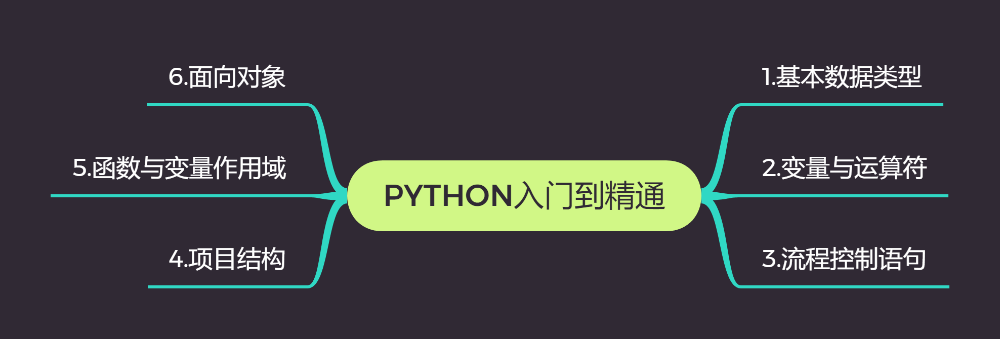
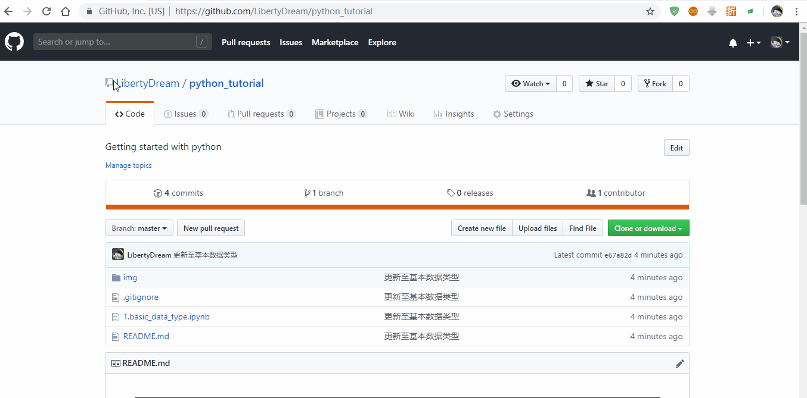

本仓库是基于个人Python3的学习笔记整理成的简明教程。对于`.ipynb`格式的教程文件，如果GitHub上观感不好，推荐使用[nbviewer](<https://nbviewer.jupyter.org/>)浏览。内容如有错误、疏漏，欢迎PR、issues交流 :)

本教程采用[知识共享署名-非商业性使用-相同方式共享 2.5 中国大陆许可协议](http://creativecommons.org/licenses/by-nc-sa/2.5/cn/)